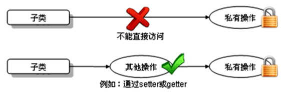

# 面向对象特性

## 一、封装性
### 1、面向对象的特征一：封装与隐藏
 问题：当创建了类的对象以后，如果直接通过"对象.属性"的方式对相应的对象属性赋值的话，可能会出现不满足实际情况的意外，我们考虑不让对象来直接作用属性，而是通过"对象.方法"的形式，来控制对象对属性的访问。实际情况中，对属性的要求就可以通过方法来体现。

### 2、面向对象思想的落地法则二：
（封装性的思想）①将类的属性私有化，②提供公共的方法（`setter & getter`）来实现调用。

### 3、四种权限修饰符

1. 权限从大到小为：`public   protected   缺省   private `
2. 四种权限都可以用来修饰   属性、方法、构造器
3. 修饰类的话：`public  &  缺省 `


## 二、继承性

### 1、为什么要有继承性：

多个类中存在相同属性和行为时，将这些内容抽取到单独一个类中，那么多个类无需再定义这些属性和行为，只要继承那个类即可。此处的多个类称为子类，单独的这个类称为父类（基类或超类）。可以理解为:“子类 
is a 父类”

1. 继承的出现提高了**代码的复用性**
2. 继承的出现让类与类之间产生了关系，**提供了多态的前提**
3. 不要仅为了获取其他类中某个功能而去继承

### 2、声明格式

通过 `class A extends B` 类实现类的继承。
子类：A
父类或基类SuperClass：B


### 3、继承
父类中声明的属性、方法，子类就可以获取到。子类除了通过继承，获取父类的结构之外，还可以定义自己的特有的成分。

extends：子类是对父类功能的“扩展”，明确子类不是父类的子集。
关于继承的规则：子类不能直接访问父类中私有的(private)的成员变量和方法。
  
Java中类的单继承：一个类只能继承一个父类。反之，一个父类可以有多个子类。
子类和父类：是相对的概念。

**问题：**
修改了父类后，父类会重新编译，子类也会重新编译吗？
答案：是。

## 三、多态性
### 多态性的表现：

1. 方法的重载与重写：   
2. 子类对象的多态性：

### 使用的前提：  

1. 要有继承关系
2. 要有方法的重写  @override

### 格式：
```
Person p = new Man();//向上转型
// 虚拟方法调用：通过父类的引用指向子类的对象实体，
// 当调用方法时，实际执行的是子类重写父类的方法
p1.eat();
p1.walk();
// p1.entertainment();
```
### 动态绑定：
编译时 `e` 为`Person`类型，实际调用是`Student`类的`getInfo()`方法。

对于多态性来说，编译时，"看左边"，将此引用变量理解为父类的类型；运行时，"看右边"，关注于真正对象的实体，子类的对象，那么执行的方法就是子类重写的。
    
编译时，认为`p`是`Person`类型的，故只能执行`Person`里才有的结构，即`Man`里特有的结构不能够调用。

**子类对象的多态性，并不适用于属性。**

### 关于向下转型：
1. 向下转型,使用强转符：()
2. 为了保证不报ClassCastException，最好在向下转型前，进行判断： `instanceof`

```
// 若a是A类的实例，那么a也一定是A类的父类的实例。
if (p1 instanceof Woman) {
    Woman w1 = (Woman) p1;
    w1.shopping();
}

if (p1 instanceof Man) {
    Man m1 = (Man) p1;
    m1.entertainment();
}
```


