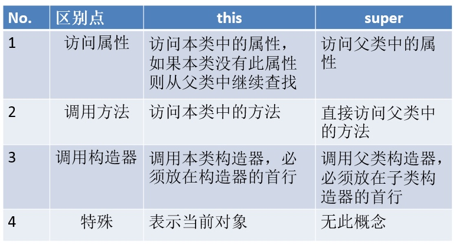

# 关键字

## package:
*  声明源文件所在的包，写在程序的第一行。
*  每`.`一次，表示一层文件目录。
*  包名都要小写。

  
## import:
 1. 显式导入指定包下的类或接口
 2. 写在包的声明和源文件之间
 3. 如果需要引入多个类或接口，那么就并列写出
 4. 如果导入的类是`java.lang`包下的，如：`System String Math`等，就不需要显式的声明
 5. 理解 `.*` 的概念。比如`java.util.*`
 6. 如何处理同名类的导入。如：在util包和sql包下同时存在Date类
 7. `import static` 静态导入: 表示导入指定类的`static`的属性或方法
 8. 导入`java.lang.*`只能导入`lang`包下的所有类或接口，不能导入`lang`的子包下的类或接口


```
//import java.util.Scanner;
//import java.util.Date;
//import java.util.List;
//import java.util.ArrayList;
import java.lang.reflect.Field;
import java.util.*;
import static java.lang.System.*;
public class TestPackageImport {
     public static void main(String[] args) {
          out.println("helloworld");
          Scanner s = new Scanner(System.in);
          s.next();
         
          Date d = new Date();
          List list = new ArrayList();
         
          java.sql.Date d1 = new java.sql.Date(522535114234L);
         
          Field f = null;
     }
}
```


## this：
1. 使用在类中，可以用来修饰属性、方法、构造器
2. 表示当前对象或者是当前正在创建的对象
3. 当形参与成员变量重名时，如果在方法内部需要使用成员变量，必须添加`this`来表明该变量时类成员
4. 在任意方法内，如果使用当前类的成员变量或成员方法可以在其前面添加`this`，增强程序的阅读性
5. 在构造器中使用`this(形参列表)`显式的调用本类中重载的其它的构造器

注意：

* 要求“this(形参列表)”要声明在构造器的首行！
* 类中若存在n个构造器，那么最多有n-1构造器中使用了this。

```
public class TestPerson {
     public static void main(String[] args) {
          Person p1 = new Person();
          System.out.println(p1.getName() + ":" + p1.getAge());

          Person p2 = new Person("BB",23);
          int temp = p2.compare(p1);
          System.out.println(temp);
     }
}
class Person{

     private String name;
     private int age;

     public Person(){
          this.name = "AA";
          this.age = 1;
     }

     public Person(String name){
          this();
          this.name = name;
     }
     public Person(String name,int age){
          this(name);
          this.age = age;
     }

     public String getName() {
          return name;
     }
     public void setName(String name) {
          this.name = name;
     }
     public int getAge() {
          return age;
     }
     public void setAge(int age) {
          this.age = age;
     }
     public void eat(){
          System.out.println("eating");
     }
     public void sleep(){
          System.out.println("sleeping");
          this.eat();
     }
     //比较当前对象与形参的对象的age谁大。
     public int compare(Person p){
          if(this.age > p.age)
               return 1;
          else if(this.age < p.age)
               return -1;
          else
               return 0;
     }

}
```

## super：
相较于关键字 `this`，可以修饰属性、方法、构造器
在Java类中使用super来调用父类中的指定操作：

*  `super` 可用于访问父类中定义的属性，
*  `super` 可用于调用父类中定义的成员方法
*  `super` 可用于在子类构造方法中调用父类的构造器


### super 修饰属性、方法：
在子类的方法、构造器中，通过`super.`属性或者`super.`方法的形式，显式的调用父类的指定属性或方法。尤其是，当子类与父类有同名的属性、或方法时，调用父类中的结构的话，一定要用`super.`。

### super 调用父类构造器
通过 `super(形参列表)` 显式的在子类的构造器中，调用父类指定的构造器！

任何一个类（除Object类）的构造器的首行，要么显式的调用本类中重载的其它的构造器 `this(形参列表)` 或显式的调用父类中，指定的构造器 `super(形参列表)` ，要么默认的调用父类空参的构造器 `super()` 。

* 建议在设计类时，提供一个空参的构造器！
* 子类中所有的构造器默认都会访问父类中空参数的构造器
* 当父类中没有空参数的构造器时，子类的构造器必须通过 `this(参数列表)` 或者 `super(参数列表)` 语句，指定调用本类或者父类中相应的构造器，且必须放在构造器的第一行
* 如果子类构造器中既未显式调用父类或本类的构造器，且父类中又没有无参的构造器，则编译出错

### this 和 super 的区别



