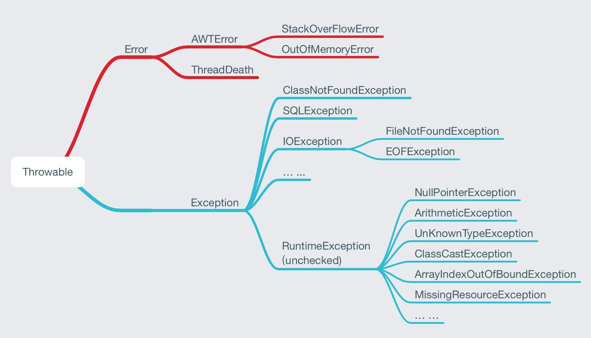

# 异常
## 异常体系结构


```
java.lang.Throwable
     |-----Error:错误，程序中不进行处理
     |-----Exception:异常，要求在编写程序时，就要考虑到对这些异常的处理
        |-----编译时异常：在编译期间会出现的异常（执行javac.exe命令时，出现异常）
        |-----运行时异常：在运行期间出现的异常(执行java.exe命令时，出现异常)  
```

因为`java`程序分为`javac.exe`和`java.exe`两个过程，在每个过程中，都有可能出现异常。故分为编译时异常、运行时异常
  
  * 对于运行时异常比较常见，可以不显式的来处理。
  * 对于编译时异常，必须要显式的处理

编译时异常，不是说有异常才处理，而是存在异常的隐患，必须在编译前，提示程序，万一出现异常，如何处理！

### Throwable（可抛出）
在 Java 中，所有的异常都有一个共同的祖先 `Throwable`（可抛出）。`Throwable` 指定代码中可用异常传播机制通过 Java 应用程序传输的任何问题的共性。

Throwable： 有两个重要的子类：`Exception`（异常）和 `Error`（错误），二者都是 Java 异常处理的重要子类，各自都包含大量子类。

### Error :
是程序无法处理的错误，表示运行应用程序中较严重问题。

大多数错误与代码编写者执行的操作无关，而表示代码运行时 JVM（Java 虚拟机）出现的问题。例如，Java虚拟机运行错误`Virtual MachineError`，当 JVM 不再有继续执行操作所需的内存资源时，将出现 `OutOfMemoryError`。这些异常发生时，Java虚拟机（JVM）一般会选择线程终止。

### Exception :
是程序本身可以处理的异常。

Exception 类有一个重要的子类 `RuntimeException`。`RuntimeException` 类及其子类表示“JVM 常用操作”引发的错误。例如，若试图使用空值对象引用、除数为零或数组越界，则分别引发运行时异常`NullPointerException、ArithmeticException`和 `ArrayIndexOutOfBoundException`。

通常，Java的异常(包括`Exception 和 Error`)分为可查的异常`checked exceptions`和不可查的异常`unchecked exceptions`。

#### 可查异常（编译器要求必须处置的异常）：
可查异常虽是异常状况，但在一定程度上它的发生是可以预计的，而且一旦发生这种异常状况，就必须采取某种方式进行处理。

除了`RuntimeException`及其子类以外，其他的`Exception`类及其子类都属于可查异常。这种异常的特点是Java编译器会检查它，也就是说，当程序中可能出现这类异常，要么用`try-catch`语句捕获它，要么用`throws`子句声明抛出它，否则编译不会通过。

#### 不可查异常（编译器不要求强制处置的异常）:
包括运行时异常（RuntimeException与其子类）和错误（Error）。

Exception 这种异常分两大类运行时异常和非运行时异常(编译异常)。程序中应当尽可能去处理这些异常。

### 注意：
异常和错误的区别：异常能被程序本身可以处理，错误是无法处理。


## 如何处理异常
Java 中的“抓抛模型”
### 1、"抛"：
当我们执行代码时，一旦出现异常，就会在异常的代码处生成一个对应的异常类型的对象，并将此对象抛出。(自动抛出   / 手动抛出)

* 一旦抛出此异常类的对象，那么程序就终止执行
* 此异常类的对象抛给方法的调用者

### 2、"抓"：
抓住上一步抛出来的异常类的对象。如何抓？即为异常处理的方式
    java 提供了两种方式用来处理一个异常类的对象。

```
//处理的方式一：
try{
    //可能出现异常的代码
}catch(Exception1 e1){
   //处理的方式1
}catch(Exception2 e2){
    //处理的方式2
}finally{
    //一定要执行的代码
}
```
注：

1. try内声明的变量，类似于局部变量，出了try{ }语句，就不能被调用；
2. finally是可选的；
3. catch语句内部是对异常对象的处理：getMessage();  printStackTrace()；
4. 可以有多个catch语句，try中抛出的异常类对象从上往下去匹配catch中的异常类的类型，一旦满足就执行catch中的代码。执行完，就跳出其后的多条catch语句；
5. 如果异常被处理了，那么其后的代码继续执行。（这就是异常处理的好处）；
6. 若catch中多个异常类型是"并列"关系，孰上孰下都可以。若catch中多个异常类型是"包含"关系，须将子类放在父类的上面，进行处理。否则报错；
7. finally中存放的是一定会被执行的代码，不管try中、catch中是否仍有异常未被处理，以及是否有return语句；
8. try-catch是可以嵌套的。
    
```   
处理方式二：
在方法的声明处，显式的使用throws + 异常类型
public void method1() throws Exception1 e1,Exception2 e2{
    //可能出现异常（尤其是编译时异常，一定要处理）
}
   
public void method2() throws Exception1 e1,Exception2 e2{
    method1();
}

public void method3(){
    try{
        method2();
    }catch(Exception1 e1){
        System.out.println(e1.getMessage());   
    }catch(Exception2 e2){
        System.out.println(e2.getMessage());   
    }
}

public static void main(String[] args){
    对象1.method3();//不会再出现上述的Exception1和Exception2的异常！
}
```

### 3、如何手动的抛出一个异常？
在方法的内部，可以使用  throw + new 异常类对象，来手动的抛出一个异常！

```
//比较两个圆的半径的大小。
public int compareTo(Object obj) throws Exception{
    if(this == obj) {
        return 0;
    }else if(obj instanceof Circle) {
        Circle c = (Circle)obj;
        if(this.radius > c.radius) {
            return 1;
        }else if(this.radius == c.radius) {
            return 0;
        }else{
            return -1;
        }
    }else{
        //return -2;
        //手动的抛出一个异常
        //throw new Exception("传入的类型有误！");
        //throw new String("传入的类型有误！");
        throw new MyException("传入的类型有误！");
    }
}
```
### 4、如何自定义一个异常类
手动的抛出一个异常，除了抛出的是现成的异常类的对象之外，还可以抛出一个自定义的异常类的对象！

#### 自定义异常类
1. 自定义的异常类继承现有的异常类
2. 提供一个序列号，提供几个重载的构造器

```
public class MyException extends Exception{  
     static final long serialVersionUID = -70348975766939L;
     public MyException(){
     }
     public MyException(String msg){
          super(msg);
     }
}
```

### 5、5个关键字搞定异常处理！
其中，要区分：throw与throws的区别？

1.  用户程序自定义的异常和应用程序特定的异常,必须借助于 throws 和 throw 语句来定义抛出异常。

* throw是语句抛出一个异常。  `throw e;`
* throws是方法可能抛出异常的声明。(用在声明方法时，表示该方法可能要抛出异常)

```
public void doA(int a) throws Exception1,Exception3{......}
```

`throws E1,E2,E3`只是告诉程序这个方法可能会抛出这些异常，方法的调用者可能要处理这些异常，而这些异常`E1,E2,E3`可能是该函数体产生的。
`throw` 则是明确了这个地方要抛出这个异常。

``` 
void doA(int a) throws IOException,{
    try{
        ......
    }catch(Exception1 e){
        throw e;
    }catch(Exception2 e){
        System.out.println("出错了！");
    }
    if(a!=b)
        throw new Exception3("自定义异常");
}
```
代码块中可能会产生3个异常，(Exception1,Exception2,Exception3)。如果产生Exception1异常，则捕获之后再抛出，由该方法的调用者去处理；如果产生Exception2异常，则该方法自己处理了，所以该方法就不会再向外抛出Exception2异常了，void doA() throws Exception1,Exception3 里面的Exception2也就不用写了。而Exception3异常是该方法的某段逻辑出错，程序员自己做了处理，在该段逻辑错误的情况下抛出异常Exception3，则该方法的调用者也要处理此异常。

* throw语句用在方法体内，表示抛出异常，由方法体内的语句处理。
* throws语句用在方法声明后面，表示再抛出异常，由该方法的调用者来处理。
* throws主要是声明这个方法会抛出这种类型的异常，使它的调用者知道要捕获这个异常。
* throw是具体向外抛异常的动作，所以它是抛出一个异常实例。
* throws说明你有那个可能，倾向。
* throw的话，那就是你把那个倾向变成真实的了。

同时：

1. throws出现在方法函数头；而throw出现在函数体。
2. throws表示出现异常的一种可能性，并不一定会发生这些异常；throw则是抛出了异常，执行throw则一定抛出了某种异常。
3. 两者都是消极处理异常的方式（这里的消极并不是说这种方式不好），只是抛出或者可能抛出异常，但是不会由函数去处理异常，真正的处理异常由函数的上层调用处理。


