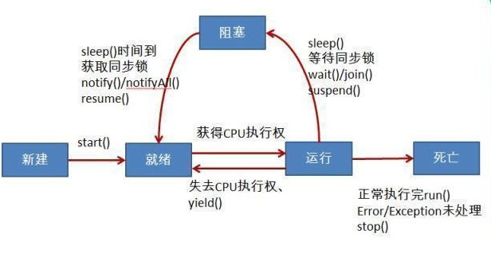

# 多线程

### 1、理解程序、进程、线程的概念
程序：静态的代码；
进程：执行中的程序，动态的过程；
线程：进程的进一步细分，程序的一条执行路径。

### 2、如何创建java程序的线程（重点）

```
方式一：继承于Thread类

/*
 * 创建一个子线程，完成1-100之间自然数的输出。同样地，主线程执行同样的操作
 * 创建多线程的第一种方式：继承java.lang.Thread类
 */

// 1.创建一个继承于Thread的子类
class SubThread extends Thread{
// 2.重写Thread类的run()方法.方法内实现此子线程要完成的功能
      public void run(){
             for( int i = 1;i <= 100;i++){
                  System. out.println(Thread. currentThread().getName() +":" + i);
            }
      }
}

public class TestThread {
      public static void main(String[] args) {
             // 3.创建子类的对象
            SubThread st1 = new SubThread();
            SubThread st2 = new SubThread();

             // 4.调用线程的start()：启动此线程；调用相应的run()方法
             //一个线程只能够执行一次start()
             //不能通过Thread实现类对象的run()去启动一个线程
            st1.start();
             //st.start();
             //st.run();
            st2.start();
            
             for( int i = 1;i <= 100;i++){
                  System. out.println(Thread. currentThread().getName() +":" + i);
            }
      }
}
```


```
方式二：实现Runnable接口
             
//1.创建一个实现了Runnable接口的类
class PrintNum1 implements Runnable {
      //2.实现接口的抽象方法
      public void run() {
      // 子线程执行的代码
            for ( int i = 1; i <= 100; i++) { 
                   if (i % 2 == 0) {
                        System. out.println(Thread. currentThread().getName() + ":" + i);
                  }
            }
      }
}

public class TestThread1 {
      public static void main(String[] args) {
             //3.创建一个Runnable接口实现类的对象
            PrintNum1 p = new PrintNum1();
//          p.start();
//          p.run();
             //要想启动一个多线程，必须调用start()
             //4.将此对象作为形参传递给Thread类的构造器中，创建Thread类的对象，此对象即为一个线程
            Thread t1 = new Thread(p);
             //5.调用start()方法：启动线程并执行run()
            t1.start(); //启动线程；执行Thread对象生成时构造器形参的对象的run()方法。
            
             //再创建一个线程
            Thread t2 = new Thread(p);
            t2.start();
      }
}
```
#### 两种方式的对比

联系：`class Thread implements Runnable`

比较哪个好？**实现的方式较好**。

1. 解决了单继承的局限性；
2. 如果多个线程有共享数据的话，建议使用实现方式，同时，共享数据所在的类可以作为Runnable接口的实现类；

### 3、线程的生命周期




### 4、线程的同步机制（重点、难点）
前提：

如果我们创建的多个线程，存在着共享数据，那么就有可能出现线程的安全问题：当其中一个线程操作共享数据时，还未操作完成，另外的线程就参与进来，导致对共享数据的操作出现问题。

解决方式：要求一个线程操作共享数据时，只有当其完成操作完成共享数据，其它线程才有机会执行共享数据。

**建议使用方式**
(非静态方法) 同步代码块(this)

(静态方法) 同步代码块(clazz)  : `Class clazz = Singleton.class`

#### 方式一：同步代码块
```
synchronized(同步监视器){
     //操作共享数据的代码
}
```
注：

1. 同步监视器：俗称锁，任何一个类的对象都可以充当锁.。要想保证线程的安全，必须要求所有的线程共用同一把锁！
2. 使用实现Runnable接口的方式创建多线程的话，同步代码块中的锁，可以考虑是this。如果使用继承Thread类的方式，慎用this!
3. 共享数据：多个线程需要共同操作的变量。明确哪部分是操作共享数据的代码。
4. 对于非静态的方法而言，使用同步的话，默认锁为：this；
5. 对于静态的方法，如果使用同步，默认的锁为：当前类本身。以单例的懒汉式为例，`Class clazz = Singleton.class `。

#### 方式二：同步方法 
```       
//方法声明为synchronized
public synchronized void show( ){
   操作共享数据额代码
}
```

同步方法的锁默认为  this  如果使用在继承的方式实现多线程，同步方法中默认锁不可用this！

     
>同步会导致程序的执行效率降低，但是即使这样也不能不用！！！

         
#### 总结：

释放锁:  `notify()/notifyAll()`:

notify()和notifyAll()都是Object对象用于通知处在等待该对象的线程的方法。

两者的最大区别在于：

* `notifyAll()`：使所有原来在**该对象上等待**被notify的线程统统退出wait的状态，变成等待该对象上的锁，一旦该对象被解锁，他们就会去竞争。

* `notify()`：则文明得多，他只是选择一个wait状态线程进行通知，并使它获得该对象上的锁，但不惊动其他同样在等待被该对象notify的线程们，当第一个线程运行完毕以后释放对象上的锁此时如果该对象没有再次使用notify语句，则即便该对象已经空闲，其他wait状态等待的线程由于没有得到该对象的通知，继续处在wait状态，直到这个对象发出一个notify或notifyAll，它们等待的是被notify或notifyAll，而不是锁。

不释放锁:  `sleep()  , yield() , suspend()  (过时，可能导致死锁)`
     
死锁：不同的线程分别占用对方需要的同步资源不放弃，都在等待对方放弃自己需要的同步资源，就形成了线程的死锁，死锁是我们在使用同步时，需要避免的问题！


### 5、线程的通信：

重要： **如下的三个方法必须使用在同步代码块或同步方法中！**
 
#### `wait():`                
当在同步中，执行到此方法，则此线程“等待”，直至其他线程执行notify()的方法，将其唤醒，唤醒后继续其wait()后的代码

#### `notify()/notifyAll():`

* notify()调用后，并不是马上就释放对象锁的，而是在相应的synchronized(){}语句块执行结束，自动释放锁后，JVM会在wait()对象锁的线程中随机选取一线程，赋予其对象锁，唤醒线程，继续执行

* 释放自身对象锁，唤醒下一个\全部 等待线程，在同步中，执行到此方法，则唤醒其他的某一个或所有的被wait的线程。

>例题：1.两个线程交替打印1-100自然数   2.生产者、消费者的例子


