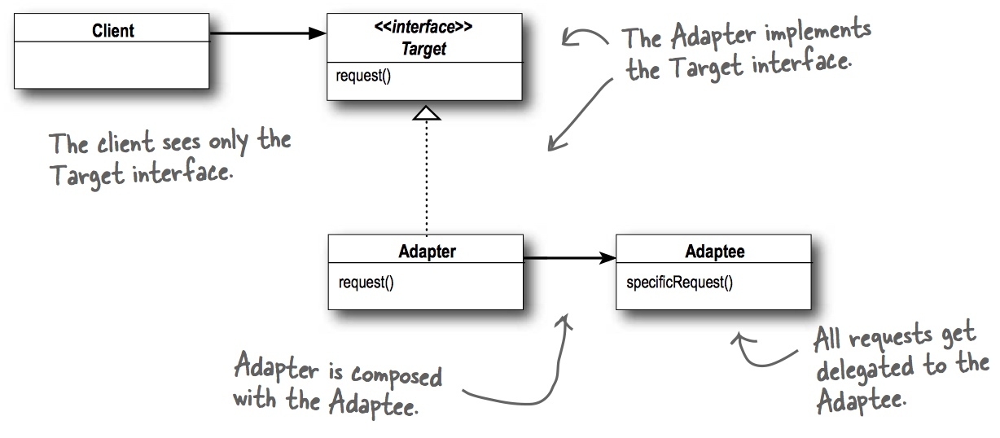

# 适配器模式 Adapter Pattern

## 定义适配器模式
将一个类的接口转换为客户期望的另一个接口。适配器让原本接口不兼容的类合作无间。


Java 适配器模式的应用，将枚举Enumeration 适配到迭代器 Iterator

### 类图

由类图可以看到，适配器实现目标接口，并且组合一个被适配者，


## 实例代码


```
public interface Duck {
	public void quack();
	public void fly();
}

```

```
public interface Turkey {
	public void gobble();
	public void fly();
}
```

```
public class MallardDuck implements Duck {
	public void quack() {
		System.out.println("Quack");
	}
 
	public void fly() {
		System.out.println("I'm flying");
	}
}

```

```
public class TurkeyAdapter implements Duck {
	Turkey turkey;
 
	public TurkeyAdapter(Turkey turkey) {
		this.turkey = turkey;
	}
    
	public void quack() {
		turkey.gobble();
	}
  
	public void fly() {
		for(int i=0; i < 5; i++) {
			turkey.fly();
		}
	}
}

```

```
package headfirst.adapter.ducks;

public class DuckTestDrive {
	public static void main(String[] args) {
		MallardDuck duck = new MallardDuck();
 
		WildTurkey turkey = new WildTurkey();
		Duck turkeyAdapter = new TurkeyAdapter(turkey);
   
		System.out.println("The Turkey says...");
		turkey.gobble();
		turkey.fly();
 
		System.out.println("\nThe Duck says...");
		testDuck(duck);
  
		System.out.println("\nThe TurkeyAdapter says...");
		testDuck(turkeyAdapter);
	}
 
	static void testDuck(Duck duck) {
		duck.quack();
		duck.fly();
	}
}

```


